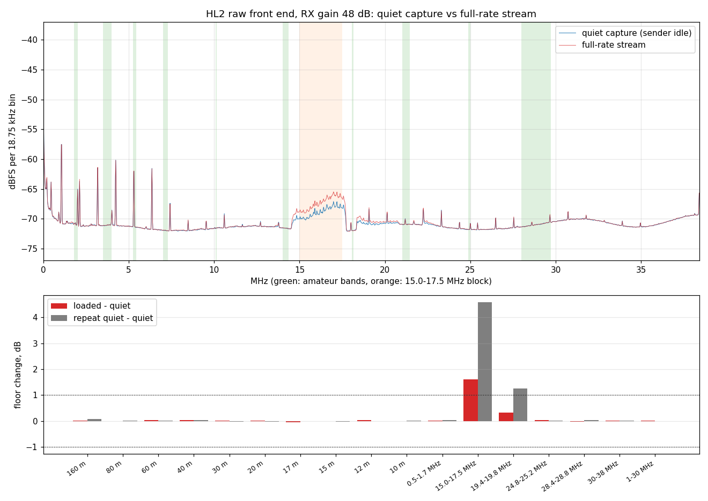

# Test results and known limits

**Tested on one radio only**: a Hermes-Lite 2 build 5 (board ID 5), direct cable to a Windows 11 PC with a
Realtek 2.5 GbE card linked at 1 Gbit/s, jumbo frames 9014. A 50-ohm dummy load was on the antenna connector.
The transmitter was never keyed.

Contents: [build](#build) · [simulation](#simulation) · [on the radio](#on-the-radio) ·
[noise](#receiver-noise-with-full-rate-streaming) · [not tested](#not-tested) ·
[features left out](#features-left-out) · [known limits](#known-limits)

## Build

- Quartus Prime Lite 20.1.1, EP4CE22E22C8: 18,498 logic elements (83 %), 64 of 66 memory blocks, 0 DSP
  elements.
- All clocks meet timing except the stock `phy_tx_en` output pin (-0.257 ns, slow 85 °C model only), which
  every HL2 image has, stock included. Ethernet send clock +0.133 ns, receive +0.680 ns. Full table:
  [TOOLCHAIN.md](TOOLCHAIN.md#resources-and-timing-to-expect).
- The release source rebuilds the bitstream that was tested on the radio bit for bit (SHA-256
  `9219973f8abd71c719e0156604f7e18e43ce46b5de5800fa62ac0fff3d7e8c40`).

Size per block (logic cells): CPU system 4,913 (NEORV32 3,645), network stack 3,410, aux channel 1,843,
control 1,482, TX sink 1,456, register bridge 1,445, raw sender 1,347, front-end register block and interlock
849 (interlock 177), command merge 91.

## Simulation

Icarus Verilog, run on this release tree. Every testbench prints PASS or stops at the first failing check.

| Testbench | What it covers | Result |
|---|---|---|
| `sim/front` ilk | interlock and register block: power-up off; permission key; lease keys relays then PA and DAC 10 ms later, PA and DAC off 10 ms before relays; every trip (lease expiry while keyed, over-temperature by code and by fan state, lowered limit, stale reading, TX inhibit, watchdog, max key-down) with outputs off and reason latched; clear only after the cause is gone; normal key-up is no trip; PTT/key inputs only when enabled; limit clamps; bridge-only watchdog disarm; command injector and I2C register to the command bus; bias unlock, LED, fan | PASS |
| `sim/front` i2c | control logic with the I2C engines and slave models on all three buses: clock chip init and EEPROM reads at power-up; write, 4-byte read, NACK, probes; bias guard refuses writes and increment commands, allows read commands, probes and unlocked writes; dropped request while busy; filter command; AD9866 SPI frames | PASS |
| `sim/front` msg | NEORV32 running the message-layer firmware with the register block and bridge: HELLO, reads, a command executed once though repeated, sequence gap not executed, unreliable permission renews the lease, refused write, I2C transfer and NACK, scan bitmap, telemetry period, event retransmitted until acknowledged, watchdog kept armed, console datagram handed to the boot ROM | PASS |
| `sim/front` echo | TX sink, raw sender, interlock and AD9866 interface through the real network receive and send paths: echo with every sample checked against index and offset, lost TX frame, slow and fast sender, bursts into a full FIFO; DAC idle in echo mode even with transmit granted; real DAC: pins idle without permission, counter pattern on the AD9866 pins with permission, echo switch-on drops the DAC, lease expiry stops it and the header shows the trip | PASS |
| `sim/cpu` asmi | the flash megafunction with an SPI flash model: stock erase clears 0x1F0000, this image's erase does not; CPU programs and reads only inside the sector; lock-out after a network erase | PASS |
| `sim/cpu` neo | CPU system with the real boot ROM and demo: boot with an empty sector, console replay, bridge access, halt and reset, RAM load and start, crash, save and boot, stay-in-ROM, refusal of another CPU's saved image, gdb protocol (registers, memory, load, breakpoints, single steps including over ROM calls and at non-word-aligned pc, Ctrl-C, monitor, detach) | PASS |
| `sim/rawstream` rawstream, duplex, aux, bridge | raw sender, TX sink, aux channel and register bridge through the real RGMII receive and send modules, with a 50 ppm clock offset: pattern checked, lost/corrupted/slow/fast TX frames, aux echo and counter stream beside full-rate samples, bridge reads during full-rate streaming with 0 cycles of delay to raw frames | PASS |

## On the radio

### This release (2026-09-16)

| Test | Result |
|---|---|
| Network flash of the release `.rbf` while the same image ran | programmed, restarted, marker 0xD1, saved firmware booted ([screenshot](images/hl2flash.png)) |
| Discovery | gateware 74.2, board 5, 0 receivers, marker 0xD1 |
| Raw stream, test pattern, N = 5,968, 10 s | **0 lost frames, 0 bad samples**, 924.7 Mbit/s, radio FIFO peak 5,984 of 8,192, safety byte 0x01 throughout ([screenshot](images/rawcap_stream.png)) |
| Echo, 15 s, full rate both ways | radio to PC 927 Mbit/s with 0 frames lost; PC to radio 905 Mbit/s, radio counted 0 lost; **1.15 billion echoed samples matched, 0 bad**; round trip PC to radio to PC average 0.55 ms (min 0.36, max 1.52) ([screenshot](images/rawcap_echo.png)) |
| I2C scans through the bridge | bus 1: 0x6A clock chip; bus 2: 0x20 filter board, 0x2C bias pots; bus 3: 0x34 slow ADC. Bias pot wiper 0 read 0x058 ([screenshot](images/hl2bus_i2c.png)) |
| Register block | ID IO01, defaults (lease 100 ms, 600 s, 55 °C, watchdog 1,000 ms), watchdog armed by the firmware, safety byte 0x01 ([screenshot](images/hl2bus_front.png)) |
| Health console example | load and run in under 0.1 s; scan names the chips; status, bias pots, D3 override refused ([screenshot](images/health_console.png)) |
| gdb over UDP | load 6,364 bytes at 79 kB/s, breakpoint, backtrace, next, step, registers, continue to the breakpoint again, print, detach. While stopped the CPU watchdog fired and showed as a transmit cut-off; the next kick after detach cleared it ([screenshot](images/gdb_session.png)) |
| Save and boot the message-layer firmware | saved in 0.6 s, booted, HELLO answered ([screenshot](images/hl2fw_save.png)) |
| Noise test at 20 dB and 48 dB RX gain | PASS: no amateur band moved more than 0.10 dB (next section) |

### Earlier on the same image (2026-09-16)

| Test | Result |
|---|---|
| Raw stream, 20 s, with the message firmware running | 257,798 frames, 924.6 Mbit/s, 0 lost, FIFO peak 5,984 |
| Echo, 30 s | PC to radio 914 Mbit/s (386,167 of 386,170 frames arrived, 3 in flight at stop), radio to PC 927 Mbit/s, 0 lost; 2.28 billion samples matched, 0 bad; round trip average 0.57 ms, max 3.24 ms. Four more echo runs (3 x 40 s, 1 x 30 s) after the last fix: 0 bad samples |
| Bridge | ID, version 0x4A02D101, capabilities 0x7C, temperature, scratch test |
| Bias guard | a write of wiper 0 with its own value while locked was refused and counted; wiper unchanged |
| Interlock without keying | permission without key: lease valid, transmit off, outputs off. Watchdog armed from the bridge and not kicked: fired, cut-off shown, disarm cleared it. Temperature limit lowered below the reading: over-temperature cut-off, safety byte 0x41. A limit above 55 °C reads back 55 °C. The "PA, relay or bias driven" bit stayed 0 throughout |
| Command bus | RX gain command through the injector reached the bus; fan minimum and LED override registers read back |
| Message layer | HELLO, READ, SCAN of three buses, I2C reads and a NACK, CMD, telemetry at 10 Hz, permission renewal without key, refused RAM write, events for a cut-off appearing and going, console attach while the firmware runs |
| Loss test | 300 reliable commands with 20 % of datagrams dropped each way: all answered, each executed exactly once |
| CPU crash and recovery | firmware overwritten through the bridge: CPU stopped (illegal instruction), watchdog fired, bridge still working; network reflash with the CPU crashed succeeded and the saved firmware booted |

Results of the intermediate test images (link capacity, aux channel, CPU noise): [HISTORY.md](HISTORY.md).
Highlights: the aux channel carried 50.8 Mbit/s from radio to PC beside the full stream with nothing lost on
the link; with the CPU held in reset, sleeping or in a busy loop, no amateur band moved more than 0.11 dB, and
nothing appeared at the CPU clock frequency or its harmonics.

## Receiver noise with full-rate streaming

Question: does sending 930 Mbit/s through the HL2's Ethernet port while it samples raise the receiver's noise
floor or add spurs? Method (`software/rawstream/noisetest.py`, [TOOLS.md](TOOLS.md#noisetestpy)): dummy load;
three captures per gain of about one second of signal each: quiet capture (sender idle while the samples are
taken), full-rate stream, and quiet again; spectra averaged over about 20,000 4,096-sample segments (18.75 kHz
bins); median floor per band with spurs excluded.

Result: **no amateur band from 160 m to 10 m moved by more than 0.10 dB** with the stream on, at either gain,
and no new spur more than 6 dB above the floor appeared in any amateur band. 6 m lies above the 38.4 MHz
Nyquist frequency and is not measured.

RX gain 48 dB (the most sensitive setting), second run:

| Band or block | MHz | Quiet floor (dBFS per bin) | Loaded - quiet (dB) | Repeat quiet - quiet (dB) |
|---|---|---|---|---|
| 160 m | 1.800-2.000 | -70.8 | +0.02 | +0.08 |
| 80 m | 3.500-4.000 | -71.1 | -0.01 | +0.01 |
| 60 m | 5.250-5.450 | -71.4 | +0.03 | +0.01 |
| 40 m | 7.000-7.300 | -72.0 | +0.04 | +0.03 |
| 30 m | 10.100-10.150 | -71.6 | +0.02 | -0.03 |
| 20 m | 14.000-14.350 | -71.6 | +0.01 | -0.03 |
| 17 m | 18.068-18.168 | -72.0 | -0.05 | +0.00 |
| 15 m | 21.000-21.450 | -70.9 | -0.02 | -0.03 |
| 12 m | 24.890-24.990 | -71.8 | +0.03 | -0.01 |
| 10 m | 28.000-29.700 | -71.0 | -0.01 | +0.00 |
| 0.5-1.7 MHz | | -70.5 | +0.01 | +0.03 |
| **15.0-17.5 MHz** | | -68.8 | **+1.61** | **+4.58** |
| 19.4-19.8 MHz | | -70.9 | +0.33 | +1.25 |
| 24.8-25.2 MHz (CPU clock) | | -71.8 | +0.03 | +0.02 |
| 28.4-28.8 MHz | | -71.1 | -0.03 | +0.04 |
| 30-38 MHz | | -70.4 | +0.00 | +0.01 |

RX gain 20 dB: every band within +0.01 to +0.09 dB, 15.0-17.5 MHz +0.23 dB; the floor there (-90 dBFS per
bin) is set by the ADC. Plot: [noise_gain20.png](images/noise_gain20.png); the whole terminal output:
[noisetest_terminal.png](images/noisetest_terminal.png).

**The 15.0-17.5 MHz block** (between 20 m and 17 m, not an amateur band) is the one place that moves. At high
gain it already sits 2-3 dB above the surrounding floor in quiet captures and changes by up to 4.6 dB between
two quiet captures, so these runs cannot separate a streaming effect from its own drift. On the first test
image, with the same method, it rose 3.4 dB with streaming while two quiet captures agreed within 0.15 dB.
It is related to Ethernet activity (PHY or RGMII energy reaching the front end). Anyone who needs 15-17.5 MHz
should measure it on their own radio.

In the first of two runs at 48 dB gain, one comb line at 1.050 MHz (a line of a 1.066 MHz comb present in all
captures) crossed the 6 dB spur threshold in the loaded capture only; it did not in the second run. A whole-band
median (1-30 MHz) moved by 0.02 dB in the same runs, which is why the test judges band by band.

## Not tested

- **Real transmit**: the key bit was never set; the PA, the T/R relays and the AD9866 transmit DAC were never
  driven. Relay and PA sequencing, the DAC output and interlock trips while keyed are simulation results only.
- Trip latching on the radio (it needs a transmit request); the key, PTT and TX inhibit inputs were never
  operated, so their debounce and the safety-byte bits 3-5 were not seen changing.
- LEDs and fan observed physically: the LED and fan register writes were read back, and the Morse sequence was
  seen in the LED register over the bridge, but nobody looked at the radio.
- Filter board relay switching and band volts on the radio.
- The N2ADR Pico IO board (not fitted on the test radio).
- A real power cycle: every restart was a network reboot or reflash, which reconfigures the FPGA.
- 100 Mbit/s links; network switches; media converters; Linux PCs.
- LiteX `litex_server` against the register bridge.
- Runs longer than 5 minutes on this image family.
- Full-rate TX pacing without underflows and overflows: the PC's card sends in bursts; the closed-loop pacing
  holds the average rate but the radio's TX FIFO still overflows and refills during a run.
- Interactive Ctrl-C in a gdb console window or an IDE (gdb MI interrupt works); gdb with the message-layer
  firmware running ([RISCV.md](RISCV.md#limits)).

## Features left out

| Stock HL2 feature | Status | Why |
|---|---|---|
| openHPSDR receivers, IQ and bandscope streams | removed | all signal processing moves to the client; freed the logic, memory and DSP blocks for the CPU and the TX FIFO |
| CW keyer and sidetone in gateware | removed | the client generates CW in its TX samples; the key and PTT inputs can still key through the interlock |
| Hardrock-50 band data (UART on DB1 pin 3) | not included | band data for a Hardrock-50 moves to the N2ADR Pico IO board, reachable over I2C |
| ICOM AH-4 tuner control (DB1 pins 5 and 6) | not included | not needed yet; would need its own transmit inhibit path into the interlock |
| Client-driven spare output pins (DB1 pins 1, 3, 6, hl2link outputs) | held at their stock idle levels | a free output could key an external amplifier around the interlock |
| EER envelope PWM, hl2link, AK4951 audio board | not included | not needed for a raw front end |
| Quisk and other openHPSDR programs | not compatible | the image has no receivers. It still answers the stock discovery and network-flash packets (flashing from Quisk was not tried) |

## Known limits

- **Security**: no authentication on the bridge, gdb or flashing ([SAFETY.md](SAFETY.md#network-security)).
- **No retransmission and no CRC check** on anything the radio receives. One lost raw frame loses 78 µs of
  samples, and the header says exactly how many.
- **Only about 7 % headroom** on the wire at 9,000-byte frames; standard 1,500-byte frames need 98 % of the
  link and about 79,000 datagrams a second, which Windows receivers drop.
- The PC's network card, not the radio, set every loss seen: use the settings in
  [TOOLCHAIN.md](TOOLCHAIN.md#8-network-card-setup) and read the card's discard counter.
- Memory blocks are almost used up (64 of 66): the raw FIFO is 8,192 samples, the TX FIFO 16,384, the aux echo
  FIFO 1,024 bytes, the CPU has 16 kB RAM.
- The Ethernet send path has little timing margin and moves with placement: check timing after any change.
- **gdb with the message-layer firmware**: a breakpoint hit while that firmware owns the receive ring leaves
  the gdb stub unable to wake. Recover with `hl2fw.py rom` or `run`. Not fixed in this release; the health
  example shows the pattern that avoids it ([RISCV.md](RISCV.md#limits)).
- **Stock images not rebuilt**: some shared RTL files were changed for this image. The stock variants
  (for example `hl2b5up_main`) were not rebuilt or retested from this branch; use the stock releases for them.
- A stopped CPU (gdb breakpoint, `hl2fw.py halt` or `rom`, a crash) fires the CPU watchdog once armed, which cuts
  transmit.
- Temperature, forward/reverse power and bias are raw ADC codes; only temperature and bias have conversion
  formulas (from the stock HL2 software), power is uncalibrated. There is no supply-voltage measurement.
