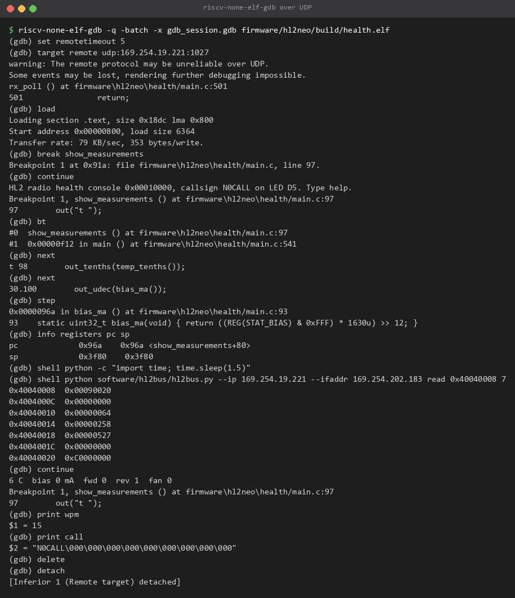
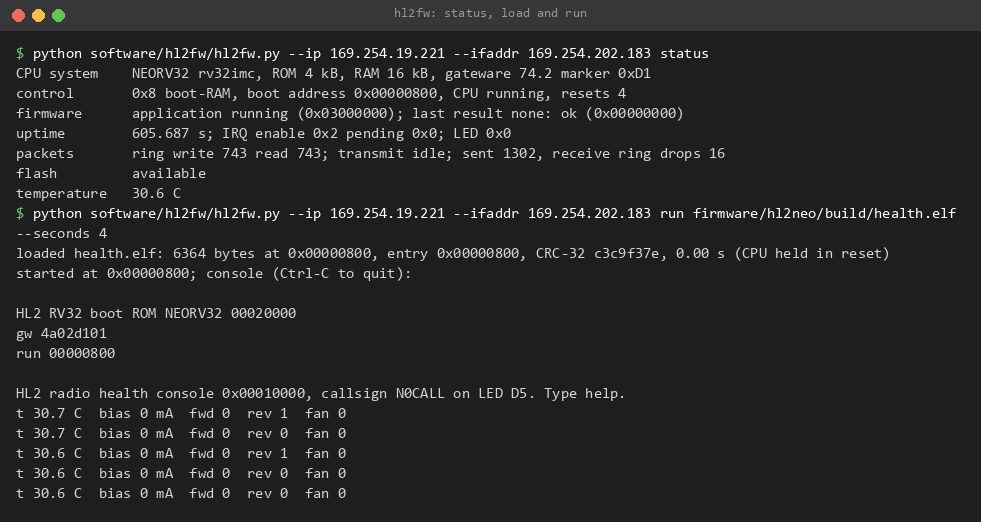
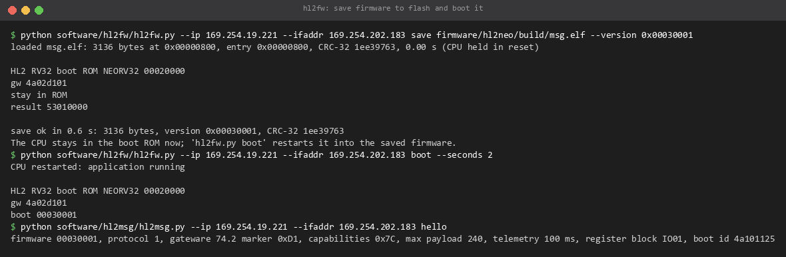
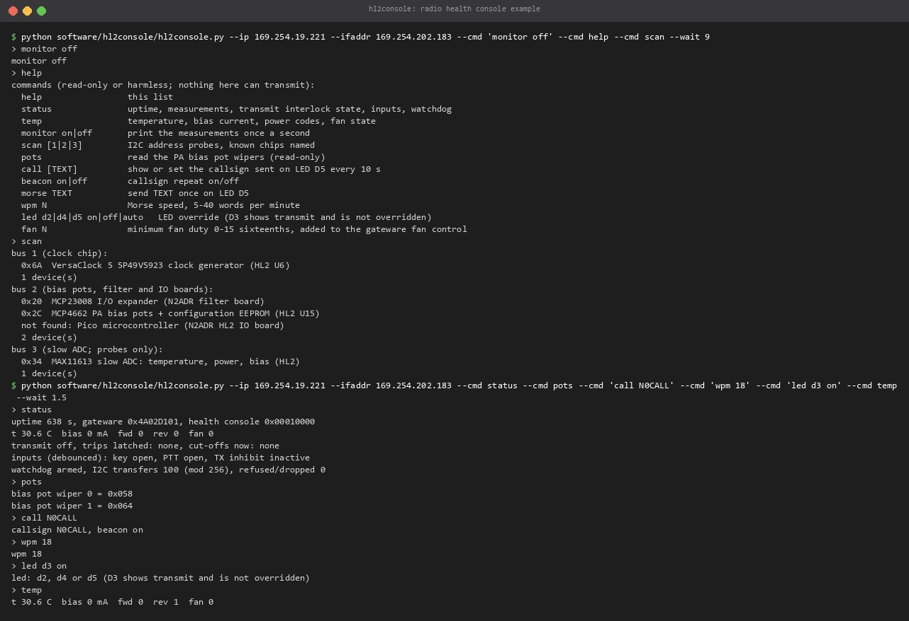

# The RISC-V CPU in the gateware

`hl2b5up_raw` contains a NEORV32 soft CPU (rv32imc + Zicsr, machine mode, 25 MHz clock). It runs small
programs from RAM beside the sample stream: slow control, I2C devices, telemetry, events. The sample paths,
the transmit interlock and network flashing stay in logic and never depend on it.

Contents: [memory map](#memory-map) · [system block](#system-block-0x4001_0000) ·
[packet interface](#packet-interface-0x4002_0000) · [flash sector](#flash-sector-0x4003_0000) ·
[boot ROM](#boot-rom) · [gdb](#gdb) · [hl2fw.py](#hl2fwpy) · [saving firmware](#saving-firmware) ·
[writing firmware](#writing-firmware) · [example: radio health console](#example-radio-health-console) ·
[limits](#limits)

## Memory map

Same addresses for the CPU and for the register bridge on UDP port 1027
([PROTOCOL.md](PROTOCOL.md#8-register-bridge-etherbone)), except that the bridge sees its own status block at
0x4000_0000 where the CPU sees a read-only copy.

| Address | Size | Contents |
|---|---|---|
| 0x0000_0000 | 16 kB RAM | 0x000-0x7FF boot ROM workspace (trap frame, variables, stack); **0x800-0x3FFF applications (14 kB)** |
| 0x0001_0000 | 4 kB ROM | boot ROM, reset vector. ROM + 8: pointer to the ROM API table |
| 0x2000_0000 | 1,024 bytes | packet buffer, one byte per 32-bit word (byte n at 0x2000_0000 + 4n): transmit buffer 0x100-0x1FF, receive ring 0x200-0x3FF |
| 0x4000_0000 | | status block, read-only copy: ID, version, capabilities, slow ADC codes, inputs, safety byte |
| 0x4001_0000 | | system block |
| 0x4002_0000 | | packet interface |
| 0x4003_0000 | | flash sector 0x1F0000-0x1FFFFF |
| 0x4004_0000 | | front-end register block: interlock, watchdog, command bus, I2C, LEDs, fan, inputs ([PROTOCOL.md](PROTOCOL.md#83-front-end-register-block-0x4004_0000)) |
| 0xFFFE_0000 | | NEORV32 SYSINFO (read-only; no other NEORV32 peripherals are built in) |

Unmapped addresses read 0xFFFF_FFFF; CPU writes there are ignored. The headers
`firmware/hl2neo/common/hl2cpu.h` (memory map, system, packet and flash registers, ROM API) and
`firmware/hl2neo/common/hl2io.h` (front-end register block) name every address and bit.

## System block 0x4001_0000

| Offset | Access | Contents |
|---|---|---|
| 0x00 | R | ID 0x5256_3332 ("RV32") |
| 0x04 | R | SYS_INFO: [31:24] map version 2, [23:16] ROM kB (4), [15:8] RAM kB (16) |
| 0x08 | RW bridge only | Control: [0] CPU held in reset, [1] halt (CPU bus frozen, state kept), [2] stay in boot ROM, [3] boot RAM (ROM jumps to the boot address). 0 at power-up |
| 0x0C | RW bridge only | Boot address for control bit 3 (0x800 at power-up) |
| 0x10 | RW | Firmware state: [31:24] 1 ROM busy, 2 ROM idle, 3 application, 4 stopped (trap or gdb; [7:0] signal) |
| 0x14 | RW | Last result: [31:24] 'S' save, 'E' erase, 'B' boot; [23:16] sequence; [7:0] code: 0 ok, 1 bad arguments, 2 CRC mismatch, 3 flash error, 4 verify error, 5 locked, 6 no saved firmware, 7 not valid, 8 saved for another CPU |
| 0x18 | R | Milliseconds since power-up |
| 0x1C | RW | Timer compare: the timer interrupt is pending while 0x18 >= this value (0xFFFF_FFFF after a CPU reset) |
| 0x20 | RW | Interrupt enable: [0] timer, [1] datagram waiting |
| 0x24 | R | Interrupt pending (levels) |
| 0x28 | RW | LED D5: [0] on, [1] the CPU drives it |
| 0x2C | R | [15:0] CPU resets since power-up, [16] in reset, [17] halted |
| 0x30 | RW | Scratch |
| 0x38 | RW | SYS_STEP: [0] holds the machine software interrupt active (the gdb single step) |

Interrupts: timer mcause 0x8000_0007 (mie.MTIE), datagram 0x8000_000B (mie.MEIE), step 0x8000_0003
(mie.MSIE). A CPU reset clears the interrupt enables, the timer compare and the LED override, not the control
register, the receive ring or RAM.

## Packet interface 0x4002_0000

Datagrams to UDP port 1027 that are not Etherbone (0x4E) or aux channel (0x5B) are copied into the receive
ring as a 2-byte little-endian length followed by the bytes; a datagram that does not fit is dropped and
counted. The CPU sends a datagram from the transmit buffer to the address and port that last sent to port 1027,
in the same send slot as bridge replies, never ahead of raw sample frames. At most 256 bytes.

| Offset | Access | Contents |
|---|---|---|
| 0x00 | R | Receive ring write position (0-1023, network side) |
| 0x04 | RW | Receive ring read position (CPU) |
| 0x08 | RW | Write N (1-256): send transmit buffer bytes 0..N-1. Read [31] busy, [30] destination known, [8:0] last N |
| 0x0C | R | [31:16] datagrams sent, [15:0] datagrams dropped (ring full) |

## Flash sector 0x4003_0000

| Offset | Access | Contents |
|---|---|---|
| 0x00 | RW | Address (24 bits) |
| 0x04 | RW | Data: byte for command 2; last byte read |
| 0x08 | W | Command: 1 erase the sector (address fixed to 0x1F0000 in logic), 2 append the data byte to the 256-byte page buffer, 3 program the page buffer at the address, 4 read one byte at the address |
| 0x08 | R | [0] busy [1] last command refused (address outside 0x1F0000-0x1FFFFF, or program not page-aligned) [2] locked [3] the ASMI block reported an illegal write or erase |

The address checks are in logic (`gateware/rtl/asmi_interface.v`), not in firmware. Network flashing always
wins: once an openHPSDR erase or programming packet has been seen, CPU flash commands are refused ("locked")
until the FPGA restarts. This image's network erase stops before 0x1F0000, so the saved firmware survives a
network flash done while `hl2b5up_raw` runs. Stock and factory images erase it.

## Boot ROM

`firmware/hl2neo/bootrom`, 4,048 of 4,096 bytes, built into the bitstream. At power-up or CPU reset it:

1. clears its workspace, drops datagrams received before the restart, prints
   `HL2 RV32 boot ROM NEORV32 00020000` and `gw <gateware version>`;
2. with control bit 3 (boot RAM) set, jumps to the boot address (`hl2fw.py run`);
3. with control bit 2 (stay in ROM) set, stays in the ROM (`hl2fw.py rom`, `save`);
4. otherwise reads the header at flash 0x1F0000 and, if valid and for this CPU, copies the image into RAM,
   checks its CRC and jumps to the entry (`boot <version>`);
5. otherwise reports `result 42xx0006` (no image), `...07` (not valid) or `...08` (another CPU's format) and
   waits idle with the console and gdb working.

Saved header (32 bytes, little-endian, image follows): magic 0x4632_4C48 ("HL2F"), format 0x0002_0002
(header version 2, target NEORV32), load address, length, entry, version, CRC-32 of the image, CRC-32 of the
first 28 header bytes (zlib CRC-32). The image must fit in 0x800-0x3FFF.

The ROM also provides:

- **Console** over port 1027 ([PROTOCOL.md](PROTOCOL.md#11-console-and-gdb-datagrams)): the last 256 bytes
  are kept and replayed when a console attaches.
- **GDB remote stub** over UDP (next section).
- **Trap handling**: breakpoints, illegal instructions and other exceptions stop the application in the stub
  (`stop, mcause ...`, `pc ...` on the console). The timer interrupt goes to a handler the application
  registers; the datagram interrupt goes to the ROM.
- **ROM API** (pointer at 0x0001_0008, `struct rom_api` in `hl2cpu.h`): `con_write(buf, n)`,
  `set_irq_handler(fn)`, `crc32(crc, buf, n)`.

## gdb

The xPack `riscv-none-elf-gdb` talks to the stub directly over UDP; no OpenOCD, no JTAG.

```
riscv-none-elf-gdb firmware/hl2neo/build/health.elf
(gdb) target remote udp:169.254.19.221:1027      # stops whatever runs (SIGINT)
(gdb) load                                         # writes the ELF into RAM, sets pc to the entry
(gdb) break main
(gdb) continue
(gdb) next                                         # also step, stepi
(gdb) info registers
(gdb) x/8xw 0x40040000                             # any memory or register except the packet interface
(gdb) print some_variable
(gdb) continue                                     # Ctrl-C (or "interrupt") stops it again
(gdb) monitor save 0x00010000                      # save what "load" wrote to the flash sector, version 0x00010000
(gdb) detach                                       # the program keeps running
```

| Works | How |
|---|---|
| `load` | binary `X` packets, 384-byte packet size, about 79 kB/s |
| software breakpoints | gdb writes `ebreak` / `c.ebreak` into RAM; none in the ROM |
| `step`, `next`, `stepi` | a gateware step interrupt stops the CPU after exactly one instruction; calls into the ROM are stepped over |
| breakpoints in interrupt handlers | yes |
| registers, memory | `g`, `P`, `m`; `X` only in 0x800-0x3FFF |
| console output while running | as gdb `O` packets |
| `monitor save [version-hex]` | saves the RAM range written by `load`, entry = gdb's start address. Save right after `load`: running changes initialised data |

Not supported: hardware breakpoints and watchpoints, `vCont`, threads, breakpoints or stepping inside the ROM.
A step that returns from an application interrupt handler stops inside the ROM (`??`); `continue` gets out.

Notes:

- gdb warns that UDP may be unreliable. gdb's acknowledgements cover a lost command (it resends after
  `remotetimeout`). On a direct cable no loss was seen.
- **A stopped CPU fires the CPU watchdog** (armed by firmware that kicks it) after its timeout, 1 s by
  default. That is a transmit cut-off: harmless on a receive-only setup, but a transmitting client loses
  permission. The next kick after `continue` clears it.
- In MI front ends and scripts on Windows, interrupting a running target needs async mode:
  `set mi-async on` before `target remote`, then `continue &` and `interrupt`.
- VS Code (cortex-debug or cppdbg): debugger path `riscv-none-elf-gdb`, connect command
  `target remote udp:<radio>:1027`, `load` in the launch commands.
- The radio answers whoever sent to port 1027 last. Do not run `hl2fw.py`, `hl2console.py` or `hl2bus.py`
  while gdb waits for a reply. A short `shell` command between gdb commands is fine, as below.



*A real session against the radio (batch mode, commands from a file; gdb's command echo is shown as
`(gdb)` prompts, two gdb character-encoding warnings are left out, and the `shell` output is moved below
its command because gdb flushed it first). The register read while the CPU was stopped shows the watchdog
fired (0x4004_0020 = 0xC000_0000) and the matching cut-off in ILK_STATUS (0x0009_0020: no lease, watchdog).
After `detach` the program kicked the watchdog again.*

## hl2fw.py

`software/hl2fw/hl2fw.py`, Python standard library only. It works through the register bridge, so it does not
need the CPU or the ROM to be healthy.

```
hl2fw.py --ip 169.254.19.221 --ifaddr 169.254.202.183 status
hl2fw.py --ip ... load FILE [--addr 0x800]        # CPU held in reset, ELF or binary written to RAM and verified
hl2fw.py --ip ... run FILE [--seconds S]          # load, start in boot-RAM mode, show the console
hl2fw.py --ip ... save FILE --version 0x00030001  # load, restart into the ROM, save to flash with CRC check
hl2fw.py --ip ... boot [--seconds S]              # restart; the ROM starts the saved firmware
hl2fw.py --ip ... rom                             # restart and stay in the ROM (saved firmware not started)
hl2fw.py --ip ... erase                           # erase the saved firmware (after rom)
hl2fw.py --ip ... halt | resume | reset [--hold]
hl2fw.py --ip ... console [--seconds S]           # attach and print the console
```



*`status`, then `run` of the health console example: 6,364 bytes loaded and verified, the boot ROM banner,
the program's banner and its once-a-second measurements.*

## Saving firmware

The radio normally runs the message-layer firmware (`firmware/hl2neo/msg`, version 0x0003_0001) from the
flash sector. To put it back, for example after flashing from another image or after trying an example:

```
python firmware/hl2neo/build.py
python software/hl2fw/hl2fw.py --ip 169.254.19.221 --ifaddr 169.254.202.183 save firmware/hl2neo/build/msg.elf --version 0x00030001
python software/hl2fw/hl2fw.py --ip 169.254.19.221 --ifaddr 169.254.202.183 boot
python software/hl2msg/hl2msg.py --ip 169.254.19.221 --ifaddr 169.254.202.183 hello
```



*Saving the message-layer firmware, booting it, and checking it with a HELLO request.*

`hl2fw.py run` and gdb `load` only change RAM: the saved firmware starts again at the next `boot`, reboot or
power-up.

## Writing firmware

Start from `firmware/hl2neo/demo` (the smallest program) or `firmware/hl2neo/health` (commands, I2C, LEDs).
Add a build step to `firmware/hl2neo/build.py` like the `health` one.

Rules:

- **Link at 0x800** with `firmware/hl2neo/demo/link.ld`; code, data and stack must fit below 0x4000 (the
  linker script keeps 1 kB of stack). Start-up code: `demo/crt0.S` (stack, bss, `main`, and small helpers
  `cpu_wfi`, `irq_on`, `irq_off`, `timer_irq_on`).
- Build with `-march=rv32imc_zicsr -mabi=ilp32 -Os -ffreestanding -nostdlib`, link with `-lgcc`. No C library.
- **Do not change `mtvec` or use `mscratch`**: the ROM's trap entry owns them. Register a timer interrupt
  handler with `ROM_API->set_irq_handler(fn)`; the handler gets `mcause`.
- **Console output** with `ROM_API->con_write(buf, n)`. The ROM keeps 256 bytes and sends on each call: write
  long text in pieces of at most about 128 bytes.
- **Sleep** with `wfi` (check the wake-up condition with interrupts off, then `cpu_wfi()`, then `irq_on()`),
  or poll. NEORV32 wakes from `wfi` only on an interrupt enabled in `mie` and `SYS_IRQ_EN`.
- **Kick the CPU watchdog** (`REG(IO_WDOG) = IO_WDOG_KEY`) from the main loop once it matters: the first kick
  arms it, and from then on a hang cuts transmit.
- **Datagrams.** By default leave the receive ring to the ROM (packet interrupt on): console and gdb keep
  working. To receive your own datagrams, read the ring with interrupts off, handle your own first byte, and
  hand anything else to the ROM as `health/main.c` does (set the ROM's read position from `rom_syms.h`, then
  enable interrupts until the ROM has read it). Keep the packet interrupt enabled in `SYS_IRQ_EN` and `mie`
  even while you own the ring, or the gdb stub cannot wake when a breakpoint stops your program.
- **Transmit.** Firmware can write TX_PERMIT and so key the transmitter. Read [SAFETY.md](SAFETY.md) first.
  Nothing in the examples does.
- Register addresses and bits: `common/hl2cpu.h`, `common/hl2io.h`.

Performance, for scale: about 1.6 million instructions per second in bit-shifting code (the core is
configured for size: serial multiplier, divider and shifter, two-cycle bus access).

## Example: radio health console

`firmware/hl2neo/health/main.c`, about 6.4 kB. Everything it does is read-only or harmless.

- I2C probes of all three buses, naming the chips known from the HL2 schematic and add-ons: VersaClock 5
  5P49V5923 clock generator (bus 1, 0x6A), AK4951 codec board (bus 1, 0x12), MCP4662 PA bias pots and
  configuration EEPROM (bus 2, 0x2C), N2ADR filter board MCP23008 (bus 2, 0x20), N2ADR Pico IO board (bus 2,
  0x1D, ROM 0x41), MAX11613 slow ADC (bus 3, 0x34).
- Once a second: temperature, PA bias current, forward and reverse power codes, fan state. The HL2 has no
  supply-voltage sensor.
- A callsign in Morse code on LED D5 every 10 s (default N0CALL; `build.py --callsign <call>` or the `call`
  command).
- Commands from `software/hl2console/hl2console.py`: `help`, `status`, `temp`, `monitor on|off`,
  `scan [1|2|3]`, `pots` (read the bias pot wipers), `call [TEXT]`, `beacon on|off`, `morse TEXT`, `wpm N`,
  `led d2|d4|d5 on|off|auto` (D3 is the transmit indicator and is refused), `fan N` (minimum fan duty, can
  only add cooling).

Build, run, use, and put the normal firmware back:

```
python firmware/hl2neo/build.py --callsign N0CALL
python software/hl2fw/hl2fw.py --ip 169.254.19.221 --ifaddr 169.254.202.183 run firmware/hl2neo/build/health.elf --seconds 3
python software/hl2console/hl2console.py --ip 169.254.19.221 --ifaddr 169.254.202.183              # interactive
python software/hl2console/hl2console.py --ip 169.254.19.221 --ifaddr 169.254.202.183 --cmd scan --cmd status --wait 8
python software/hl2fw/hl2fw.py --ip 169.254.19.221 --ifaddr 169.254.202.183 boot                   # back to the saved firmware
```

With gdb instead of `hl2fw.py run`: `riscv-none-elf-gdb firmware/hl2neo/build/health.elf`, then
`target remote udp:169.254.19.221:1027`, `load`, `continue`, and `detach` when done (run gdb from the
repository root so it finds the sources).



*The example on the test radio: scan (the N2ADR filter board is fitted, the Pico IO board is not), status,
bias pot wipers, and the refused D3 override.*

Console datagrams: 0x02 followed by one command line. The firmware answers through the boot ROM console.

## Limits

- 14 kB for code, data and stack; 256-byte datagrams; no floating point.
- The message-layer firmware (`msg`) reads the receive ring with the packet interrupt disabled. A gdb
  breakpoint hit while it owns the ring leaves the stub unable to wake (found while writing the health
  example, which avoids it; `msg` was not changed because it is the tested saved firmware). Recover with
  `hl2fw.py rom` or `run`. Debug your own firmware with the pattern in `health/main.c`.
- Not verified on the radio: interactive Ctrl-C in a gdb console window or VS Code (MI `-exec-interrupt`
  works), datagram loss under gdb, stepping out of an application interrupt handler.
- Future option, not built: NEORV32's on-chip debugger driven through the register bridge instead of JTAG,
  for hardware breakpoints without a stub.
