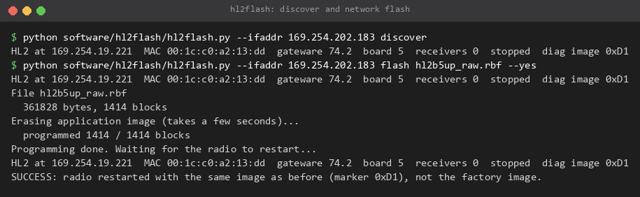

# Toolchain, build, simulation, flashing and network setup

Everything here was run on Windows 11 with the versions listed. Commands are for Git Bash (the `.sh`
scripts) or any shell for the Python tools. Run them from the repository root unless a step says
otherwise. Nothing needs administrator rights except the network card settings.

## 1. Tools and versions

| Tool | Version used | Needed for |
|---|---|---|
| Intel Quartus Prime Lite | 20.1.1 Build 720, with Cyclone IV device support | building the gateware |
| xPack GNU RISC-V Embedded GCC | 15.2.0-1 (includes GDB 16.3) | firmware; gdb |
| Icarus Verilog (from YosysHQ oss-cad-suite) | 14.0 (devel) s20260301, suite 2026-09-12 | simulation |
| Quartus simulation models `altera_mf.v`, `220model.v` | from Quartus 20.1.1 | simulation |
| GHDL | 6.0.0, mcode backend, UCRT64 build | only to re-convert NEORV32 to Verilog |
| Python | 3.10.11 | all Python tools (standard library only) |
| numpy, matplotlib | 2.1.3, 3.10.8 | `analyse.py`, `noisetest.py` |
| Pillow | 12.0.0 | only `docs/rawfront/images/term2png.py` |
| Rust (rustup, stable) | 1.88.0 | `rawcap` |
| Git for Windows (Git Bash) | any | the `.sh` scripts |

Verilator is in the oss-cad-suite too, but the testbenches are written for Icarus Verilog and Verilator was
not used (on Windows the suite's Verilator also needs Perl modules and a C++ compiler).

## 2. Install

**Quartus Prime Lite 20.1.1.** Download from Intel (Quartus Prime Lite Edition, 20.1.1, with the Cyclone IV
device package) and install to the default `C:\intelFPGA_lite\20.1.1`. Put the tools on `PATH`:

```
export PATH="/c/intelFPGA_lite/20.1.1/quartus/bin64:$PATH"      # Git Bash
quartus_sh --version
```

**RISC-V compiler.** Unzip without installing:

- `https://github.com/xpack-dev-tools/riscv-none-elf-gcc-xpack/releases/download/v15.2.0-1/xpack-riscv-none-elf-gcc-15.2.0-1-win32-x64.zip`
- SHA-256 `85ef714dacd273b1dadf4af4892774520ac01915bfa6da816a56e7e41591e09e`
- Unzip to `C:\tools\xpack-riscv-none-elf-gcc-15.2.0-1`. `firmware/hl2neo/build.py` uses that path; any other
  location: `export RISCV_PREFIX=/path/to/bin/riscv-none-elf-` (the prefix, ending in `-`).
- The simulation scripts find `riscv-none-elf-nm` through `RISCV_NM` if it is not at that path.

**Icarus Verilog.** Unzip the YosysHQ oss-cad-suite for Windows to `C:\tools\oss-cad-suite` and put
`C:\tools\oss-cad-suite\bin` and `...\lib` on `PATH` for the simulation shell. The scripts take the Quartus
models from `/c/intelFPGA_lite/20.1.1/quartus/eda/sim_lib`; elsewhere set `QUARTUS_SIM`.

**GHDL** (optional):

- `https://github.com/ghdl/ghdl/releases/download/v6.0.0/ghdl-mcode-6.0.0-ucrt64.zip`
- SHA-256 `76e160ceec35834c73ada6e4e484416d13aed4b64cbc7c74c5cca53a7ef60e41`
- Unzip to `C:\tools\ghdl-6.0.0`, or set `GHDL=/path/to/ghdl`.

**Python.** Python 3.10 or newer. For the analysis tools: `python -m pip install numpy matplotlib`
(and `pillow` to render screenshots).

**Rust.** Install with rustup (`https://rustup.rs`), stable toolchain, MSVC target on Windows.

## 3. Build the firmware

```
python firmware/hl2neo/build.py
```

Output in `firmware/hl2neo/build/`: `bootrom.elf/.bin`, `demo.elf/.bin`, `msg.elf/.bin` (the saved
message-layer firmware), `health.elf/.bin` (the example). It also writes the boot ROM into
`gateware/variants/hl2b5up_raw/bootrom.mif` (built into the bitstream) and the simulation copies
`gateware/sim/cpu/bootrom_neo.hex` and `gateware/sim/front/msg_ram.hex`. Expected sizes: boot ROM 4,048
of 4,096 bytes, demo 564, msg 3,136, health about 6,400. Options: `--callsign N0CALL` (health example),
`--size` (symbol sizes).

Compiler flags: `-march=rv32imc_zicsr -mabi=ilp32 -Os`; the boot ROM adds `-msave-restore -fno-jump-tables`.

## 4. Build the gateware

```
python firmware/hl2neo/build.py                        # the boot ROM goes into the bitstream
cd gateware/variants/hl2b5up_raw
quartus_sh --flow compile hermeslite -c hermeslite     # about 4 minutes
```

Output: `build/hermeslite.rbf` (the file to flash), `build/hermeslite.sof` (JTAG), reports
`build/hermeslite.fit.summary` and `build/hermeslite.sta.summary`.

With Quartus Prime Lite 20.1.1 Build 720 this source reproduces the released bitstream exactly:
`sha256sum build/hermeslite.rbf` gives `9219973f8abd71c719e0156604f7e18e43ce46b5de5800fa62ac0fff3d7e8c40`.

Do not use `make` in the variant folder for normal work: besides the same compile it creates JTAG files,
including a `.jic` that would replace the factory image if programmed ([RECOVERY.md](RECOVERY.md#4-last-resort-jtag)).

### Resources and timing to expect

EP4CE22E22C8: 18,498 logic elements (83 %), 64 of 66 memory blocks, 514,064 memory bits, 0 DSP elements,
80 of 80 pins.

Worst slack in ns from `build/hermeslite.sta.summary`, fitter seed 5:

| Clock | Slow 85 °C setup | Slow 0 °C setup | Fast 0 °C setup | Slow 85 °C hold | Fast 0 °C hold |
|---|---|---|---|---|---|
| clock_ethtxintfast (Ethernet send, 125 MHz) | +0.133 | +0.637 | +4.618 | +0.433 | +0.177 |
| clock_ethrxintfast (Ethernet receive) | +0.680 | +0.748 | +0.588 | +0.286 | +0.097 |
| clock_153p6MHz | +0.586 | +0.783 | +0.750 | +0.466 | +0.192 |
| clock_76p8MHz (AD9866) | +1.572 | +2.365 | +8.286 | +0.433 | +0.151 |
| clock_2_5MHz (control) | +2.268 | +2.558 | +5.319 | +0.453 | +0.176 |
| clock_25MHz (CPU) | +16.241 | +17.415 | +29.548 | +0.453 | +0.186 |
| virt_ad9866_rxclk_tx (AD9866 TX pins) | +0.231 | +0.709 | +2.728 | +2.530 | +0.513 |
| clock_txoutputfast (`phy_tx_en` pin) | **-0.257** | +0.022 | +0.570 | +0.754 | +0.483 |

The only negative slack is the `phy_tx_en` output pin in the slow 85 °C model. The stock `hl2b5up_main`
image has exactly the same -0.257 ns on the same path; it is not caused by this work.

The Ethernet send clock is placement-sensitive (a stock path from the UDP byte counter into the MAC shift
register). Over seven fitter seeds on a late version of this design it ranged from -0.609 to +0.282 ns. After
any RTL change, check `clock_ethtxintfast` and `clock_ethrxintfast` and try other seeds if either is negative.

### Seed sweep

After one full compile (synthesis is reused):

```
cd gateware/variants/hl2b5up_raw
./seed_try.sh 1          # fitter + timing with seed 1; prints the Ethernet slacks, appends to seeds.txt
./seed_try.sh 2
...
```

`seed_try.sh` writes the seed into `hermeslite.qsf` (`set_global_assignment -name SEED`). Put the best seed
back and run the full compile again before flashing; `seeds.txt` and `*_seed.log` are scratch files.

### Boot ROM change only

The ROM is a memory initialisation file, so a ROM change needs no new fit:

```
python firmware/hl2neo/build.py
cd gateware/variants/hl2b5up_raw
quartus_cdb hermeslite -c hermeslite --update_mif
quartus_asm hermeslite -c hermeslite                   # rewrites build/hermeslite.rbf, placement and timing kept
```

Applications need no gateware step at all ([RISCV.md](RISCV.md)).

## 5. Simulation

Git Bash, with iverilog on `PATH` and the firmware built (section 3):

```
sh gateware/sim/front/run.sh ilk        # transmit interlock and register block, ~10 s
sh gateware/sim/front/run.sh i2c        # I2C engines, bias guard, AD9866 SPI, ~25 s
sh gateware/sim/front/run.sh msg        # NEORV32 running the message-layer firmware, ~1 min
sh gateware/sim/front/run.sh echo       # echo mode and real-DAC gating through the network paths, ~20 min
sh gateware/sim/cpu/run.sh asmi         # flash erase ranges and the firmware sector guard, ~15 s
sh gateware/sim/cpu/run.sh neo          # CPU system: boot ROM, console, gdb stub, save/boot, ~10 min
sh gateware/sim/rawstream/run.sh rawstream   # raw sender through the real send path
sh gateware/sim/rawstream/run.sh duplex      # TX sink through the real RGMII receive path, ~10 min
sh gateware/sim/rawstream/run.sh aux         # aux channel, ~12 min
sh gateware/sim/rawstream/run.sh bridge      # register bridge, ~8 min
```

Without an argument each script runs all of its testbenches. Each prints `PASS` or stops with the failing
check. Build products go to `build/` next to the script (ignored by git). What each testbench covers:
[RESULTS.md](RESULTS.md#simulation).

**NEORV32 Verilog for simulation.** Quartus builds the NEORV32 VHDL sources directly. The simulations use
`gateware/rtl/neorv32/neorv32_hl2.v`, a one-module Verilog conversion of the same configuration, committed so
simulating needs no GHDL. After changing `gateware/rtl/neorv32/neorv32_hl2.vhd` or updating the core:

```
sh gateware/rtl/neorv32/convert.sh      # GHDL analysis + "ghdl synth --out=verilog", ~2 s
```

The core is NEORV32 v1.13.5 (`gateware/rtl/neorv32/VERSION`, commit b3f390870f77), copied unchanged into
`gateware/rtl/neorv32/core` from the release archive (SHA-256
`f9c50b9e9c578424241644a9a09aa5bb4eaf34c25c25cc9b9169a04dd2b82e5d`).

## 6. Flash the gateware

The radio must be stopped (no stream running). `--ifaddr` is the PC's own address on the radio's network.

```
python software/hl2flash/hl2flash.py --ifaddr 169.254.202.183 discover
python software/hl2flash/hl2flash.py --ifaddr 169.254.202.183 flash gateware/variants/hl2b5up_raw/build/hermeslite.rbf --force
python software/hl2flash/hl2flash.py --ifaddr 169.254.202.183 flash hl2b5up_raw.rbf        # the release asset
python software/hl2flash/hl2flash.py --ifaddr 169.254.202.183 reboot
```

- `flash` checks the `.rbf` header and that the file name matches the board ID (`hl2b5`); `--force` skips
  the name check (the build output is called `hermeslite.rbf`). It asks for `yes` unless `--yes` is given.
- It erases the application image, programs 1,414 blocks (under a minute), waits for the radio to restart and
  checks discovery: marker 0xD1 and 0 receivers mean the new image runs.
- Flashing from `hl2b5up_raw` keeps the saved CPU firmware. Flashing from any other image (stock, factory)
  erases it: save it again afterwards ([RISCV.md](RISCV.md#saving-firmware)).
- If anything goes wrong: [RECOVERY.md](RECOVERY.md).



*hl2flash on the test radio: discover, then a network flash of the release image while that same image was
running.*

## 7. Load the firmware

A newly flashed radio from another image has no saved firmware; the boot ROM then waits idle. Save the
message-layer firmware:

```
python software/hl2fw/hl2fw.py --ip 169.254.19.221 --ifaddr 169.254.202.183 save firmware/hl2neo/build/msg.elf --version 0x00030001
python software/hl2fw/hl2fw.py --ip 169.254.19.221 --ifaddr 169.254.202.183 boot
python software/hl2msg/hl2msg.py --ip 169.254.19.221 --ifaddr 169.254.202.183 hello
```

More in [RISCV.md](RISCV.md).

## 8. Network card setup

The stream is about 12,900 jumbo datagrams a second at 931 Mbit/s on the wire. Use a **direct cable** to a
gigabit (or faster) network card, no switch, and no other traffic on that card
([SAFETY.md](SAFETY.md#network-security)).

Settings on the test PC (a Realtek 2.5 GbE card at a 1 Gbit/s link), in Device Manager, the card's Advanced
tab:

| Setting | Value | Why |
|---|---|---|
| Jumbo Frame | 9014 Bytes | 9,000-byte IP packets: 5,968 samples per frame, 12,869 frames/s |
| Receive Buffers | driver maximum | rides out short PC stalls |
| Transmit Buffers | raised (4096 on the test PC) | full-rate TX samples in duplex and echo |
| Flow Control | Disabled | the HL2 does not handle PAUSE frames |
| Interrupt Moderation | Enabled (default) | disabling it increased drops |
| Energy-Efficient / Green Ethernet | Disabled | no link sleep |
| IPv4 | no DHCP; an automatic 169.254.x.x address or a static one in 169.254.0.0/16 | the radio picks 169.254.x.x without DHCP |

Also: Windows power plan "High performance"; allow `rawcap.exe` through the Windows firewall (a blocked
socket makes Windows answer with ICMP port unreachable, which stops the stream).

`software/rawstream/nic_setup.ps1` shows and sets these for a Realtek card:

```
powershell -ExecutionPolicy Bypass -File software/rawstream/nic_setup.ps1 -AdapterName "Ethernet"            # dry run
powershell -ExecutionPolicy Bypass -File software/rawstream/nic_setup.ps1 -AdapterName "Ethernet" -Apply     # as Administrator; saves a backup
powershell -ExecutionPolicy Bypass -File software/rawstream/nic_setup.ps1 -AdapterName "Ethernet" -Restore
powershell -ExecutionPolicy Bypass -File software/rawstream/nic_setup.ps1 -AdapterName "Ethernet" -Counters  # discard counters
```

Tell link loss from PC loss: if frames are lost but the card's `ReceivedDiscardedPackets` counter
(`-Counters`) rose by the same number, the card dropped them, not the link. On one PCIe Realtek gigabit card
the receive ring (512 buffers) overflowed and lost 2-4 % of frames; the 2.5 GbE port lost none, and could also
send the full 12,864 TX frames/s the other card could not.

Linux (not tested with this release): `ip link set dev eth0 mtu 9000`, `ethtool -A eth0 rx off tx off`,
`ethtool -G eth0 rx 4096 tx 4096`, `sysctl -w net.core.rmem_max=268435456`. `rawcap` itself is Windows-only
(section 9); the Python tools run anywhere.

## 9. Build rawcap

```
cd software/rawstream/rawcap
cargo build --release          # target/release/rawcap.exe
cargo test --release           # 20 unit tests: packing, headers, pacing controller, aux pattern
```

`rawcap` uses Windows APIs for thread priority and Ctrl-C handling; its only crate is `socket2`. Usage:
[TOOLS.md](TOOLS.md#rawcap).
