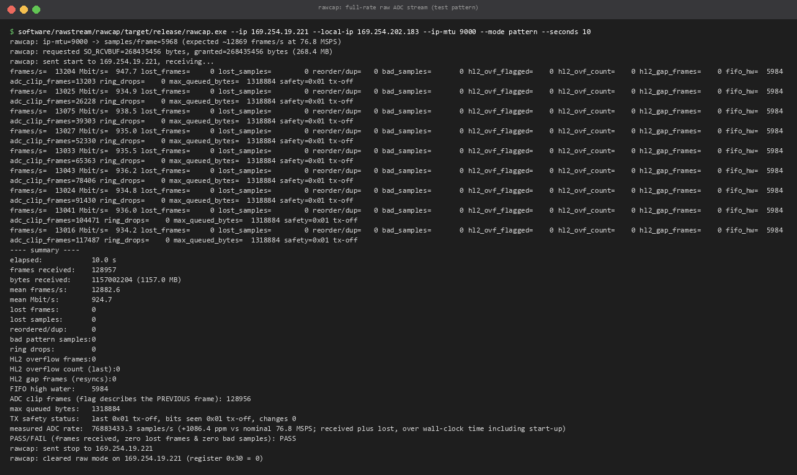
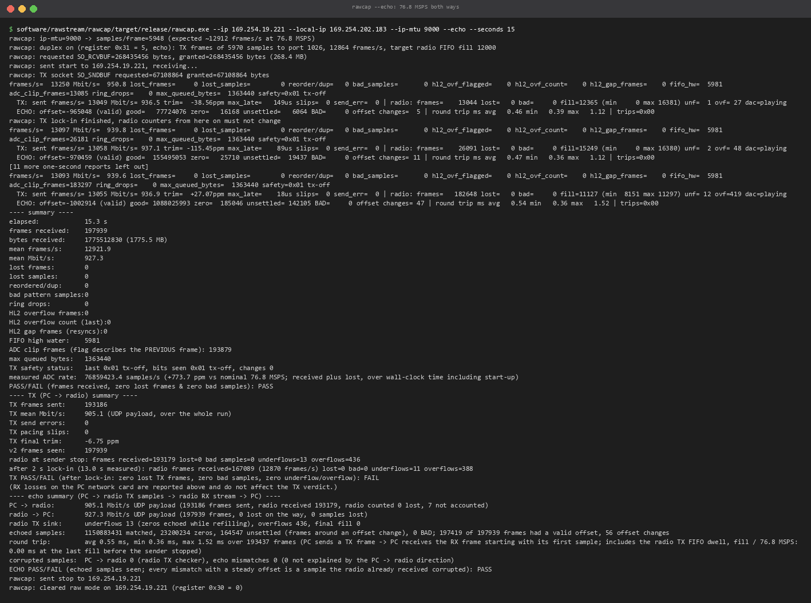
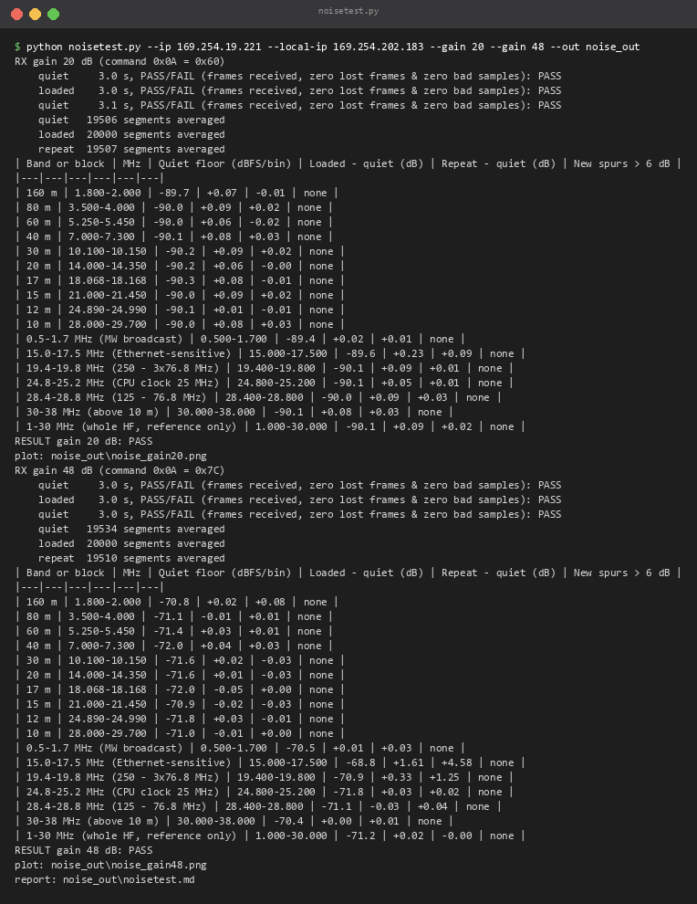
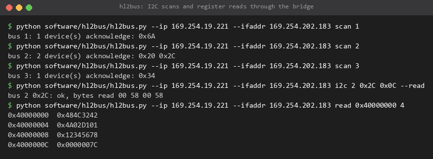
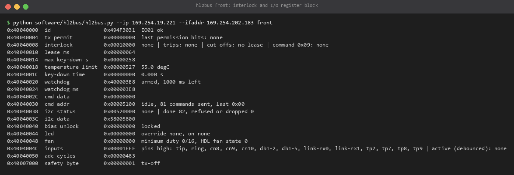

# Reference client tools

These PC tools implement every part of [PROTOCOL.md](PROTOCOL.md). They are test and reference clients, not a
radio application: use them to check a link, to learn the protocol, and as working examples for your own
client.

| Tool | Language, needs | For |
|---|---|---|
| [`software/rawstream/rawcap`](#rawcap) | Rust, Windows | raw stream receiver and checker, duplex and echo sender, aux channel test, radio emulator |
| [`software/rawstream/noisetest.py`](#noisetestpy) | Python + numpy + matplotlib, rawcap | one-command receiver noise test |
| [`software/rawstream/analyse.py`](#analysepy) | Python + numpy (+ matplotlib) | spectra of saved captures |
| [`software/hl2bus/hl2bus.py`](#hl2buspy) | Python, standard library | register bridge: registers, I2C, command bus, interlock status |
| [`software/hl2msg/hl2msg.py`](#hl2msgpy) | Python, standard library | message-layer firmware: reliable requests, telemetry, events |
| [`software/hl2fw/hl2fw.py`](RISCV.md#hl2fwpy) | Python, standard library | CPU firmware load, run, save, boot, console |
| [`software/hl2console/hl2console.py`](RISCV.md#example-radio-health-console) | Python, standard library | console and command lines for firmware such as the health example |
| [`software/hl2flash/hl2flash.py`](TOOLCHAIN.md#6-flash-the-gateware) | Python, standard library | discover, network flash, reboot |
| `software/rawstream/nic_setup.ps1` | PowerShell | [network card settings](TOOLCHAIN.md#8-network-card-setup) |

## Install

- **Python** 3.10 or newer. The register, firmware, console and flash tools need nothing else. For the
  analysis tools: `python -m pip install numpy matplotlib`.
- **rawcap**: Rust stable via rustup, then `cd software/rawstream/rawcap && cargo build --release`. The program
  is `software/rawstream/rawcap/target/release/rawcap.exe`. Windows only.
- Every tool takes the radio's address (`--ip`) and the PC's address on that network (`--ifaddr`, or
  `--local-ip` for rawcap and noisetest). All examples use the test setup: radio 169.254.19.221, PC
  169.254.202.183.
- The radio answers whichever program sent to UDP port 1027 last. Run one of `hl2bus`, `hl2msg`, `hl2fw`,
  `hl2console` and gdb at a time. `rawcap` uses other ports for samples, so `hl2bus` can run beside a stream.

## rawcap

```
rawcap --discover --local-ip 169.254.202.183
rawcap --ip 169.254.19.221 --local-ip 169.254.202.183 --ip-mtu 9000 --mode pattern --seconds 20
rawcap --ip 169.254.19.221 --local-ip 169.254.202.183 --ip-mtu 9000 --mode adc --seconds 5 --save capture.bin --save-seconds 2
rawcap --ip 169.254.19.221 --local-ip 169.254.202.183 --ip-mtu 9000 --echo --seconds 30
rawcap --ip 169.254.19.221 --local-ip 169.254.202.183 --ip-mtu 9000 --duplex --seconds 30
rawcap --ip 169.254.19.221 --local-ip 169.254.202.183 --ip-mtu 9000 --aux-rate 10 --seconds 20
rawcap --ip 169.254.19.221 --clear-raw-mode
rawcap --emulate --local-ip 127.0.0.1           # a software radio for testing clients without hardware
rawcap --help
```

What it does:

- Sets register 0x30 (raw mode, frame size from `--ip-mtu`, pattern or ADC), opens a large receive socket,
  starts the radio, checks every frame (sequence, sample index, test pattern), prints one line a second, then
  stops the radio and turns raw mode off again, also after Ctrl-C.
- `--mode pattern` checks every sample. `--mode adc` takes real samples; `--save` writes the packed sample
  bytes (headers removed) and a `.json` sidecar.
- `--quiet-capture` sets quiet-capture mode (use `--ip-mtu 6192` for 4,096-sample frames).
- `--duplex` also sends TX frames with the counter pattern at the radio's rate, paced on the TX FIFO fill in
  every header, and prints the radio's TX counters. `--echo` does the same with the radio in echo mode and checks
  every echoed sample, the loss each way and the round-trip time.
- `--aux-rate` / `--aux-radio-rate` / `--aux-only` test the aux channel.
- Verdicts: `PASS/FAIL` for the stream (no lost frames, no bad samples); `TX PASS/FAIL` in duplex (also counts
  underflows and overflows, which a PC card that sends in bursts causes); `ECHO PASS/FAIL` (every echoed sample
  right).
- Losses: frames lost in the PC's network card count as lost. Compare with the card's discard counter
  (`nic_setup.ps1 -Counters`).

Per-second fields: `frames/s`, `Mbit/s` (UDP payload), `lost_frames`, `lost_samples`, `bad_samples` (pattern
errors), `hl2_ovf_count` (radio FIFO overflows), `fifo_hw` (radio FIFO peak), `safety` (header byte 3); in
duplex `TX:` (send rate, pacing trim, radio frames/lost/bad/fill/underflows/overflows) and in echo `ECHO:`
(offset, matched, zeros while the radio refilled, unsettled around offset changes, BAD, round trip).



*10 s full-rate test pattern: 0 lost frames, 0 bad samples, 924.7 Mbit/s of samples.*



*15 s echo: 905 Mbit/s to the radio and 927 Mbit/s back at the same time, 1.15 billion echoed samples matched,
0 bad, 0.55 ms average round trip. The TX verdict fails on FIFO overflows and underflows caused by the PC
sending in bursts; the echo verdict passes. Twelve of the one-second reports are left out.*

## noisetest.py

One command that answers "does full-rate streaming add receiver noise?", band by band. Put a 50-ohm dummy load
on the antenna connector, set up the network card, build rawcap, then:

```
cd software/rawstream
python noisetest.py --ip 169.254.19.221 --local-ip 169.254.202.183 --gain 20 --gain 48 --out noise_out
```

For each `--gain` (dB, -12 to 48; default 48) it sets the RX gain, takes a quiet capture, a full-rate capture
and a second quiet capture (4,096-sample frames, `--seconds` of saving each, default 2), averages up to 20,000
spectra per capture, and prints a table per gain: for every amateur band from 160 m to 10 m and some other
blocks, the quiet floor, the change with the stream on, the change between the two quiet captures, and new
spurs more than 6 dB above the floor. Verdict per gain: PASS if no amateur band moves more than `--band-limit`
dB (default 1.0) and no new spur appears in an amateur band.

Output folder: `noise_gain<dB>.png` (spectra with band shading and a bar chart of the changes),
`noisetest.md` (the tables), `noisetest.json`. Captures are deleted unless `--keep`. The radio keeps the last
gain that was set. A run with two gains takes a few minutes.

Why band by band: a whole-band median over 1-30 MHz hides a rise of several dB that is confined to a couple of
MHz. The spectrum segments are exactly one received frame long, so a lost frame never joins two unrelated
pieces of signal.



Results and plots from the test radio: [RESULTS.md](RESULTS.md#receiver-noise-with-full-rate-streaming).

## analyse.py

Offline spectra of `rawcap --save` files:

```
python analyse.py spectrum capture.bin --tone --png capture.png      # floor, strongest spurs, tone frequency and level
python analyse.py compare quiet.bin loaded.bin --segment-size 4096 --png compare.png
```

`compare` judges one median floor over `--band-lo` to `--band-hi` (default 1-30 MHz); for noise questions use
`noisetest.py`, which judges each band. `--segment-size` should match the frame size of the capture.

## hl2bus.py

Register bridge client (no CPU needed):

```
hl2bus.py --ip 169.254.19.221 --ifaddr 169.254.202.183 probe
hl2bus.py --ip ... dump                        # status block, decoded
hl2bus.py --ip ... front                       # front-end register block, interlock and safety byte, decoded
hl2bus.py --ip ... read 0x40040000 21
hl2bus.py --ip ... write 0x40000008 0xCAFEF00D  # reads back in the same request
hl2bus.py --ip ... scan 2                      # I2C address probes (read-only)
hl2bus.py --ip ... i2c 2 0x2C 0x0C --read      # write the register pointer, read 4 bytes
hl2bus.py --ip ... cmd 0x0a 0x54               # command register 0x0A through the command bus
hl2bus.py --ip ... rxgain 20
hl2bus.py --ip ... led 0x88                    # LED override register
hl2bus.py --ip ... fan 8                       # minimum fan duty
hl2bus.py --ip ... clear-trips
hl2bus.py --ip ... wdog-disarm
hl2bus.py --ip ... permit --seconds 2          # renew the lease without the key bit: nothing transmits
hl2bus.py --ip ... scratch-test
```

`permit --key` sets the key bit and **keys the transmitter** (never used in testing). `i2c` with a value
writes to I2C devices; writes to the bias pots are refused until BIAS_UNLOCK is written.





*The front-end register block on the idle radio: no lease (the normal idle cut-off), watchdog armed by the
saved firmware, all inputs high (open), safety byte 0x01.*

## hl2msg.py

Client for the message-layer firmware (runs on the radio by default):

```
hl2msg.py --ip 169.254.19.221 --ifaddr 169.254.202.183 hello
hl2msg.py --ip ... read 0x40040000 4
hl2msg.py --ip ... scan 2
hl2msg.py --ip ... i2c 2 0x20 --read 0x09
hl2msg.py --ip ... cmd 0x0a 0x5f
hl2msg.py --ip ... telemetry --seconds 3
hl2msg.py --ip ... events --seconds 10
hl2msg.py --ip ... permit --seconds 2           # without the key bit: nothing transmits
hl2msg.py --ip ... loss-test --drop 0.2 --count 200
```

`loss-test` drops the given share of datagrams in both directions inside the client and checks that every
reliable command is answered and executed exactly once on the radio.
